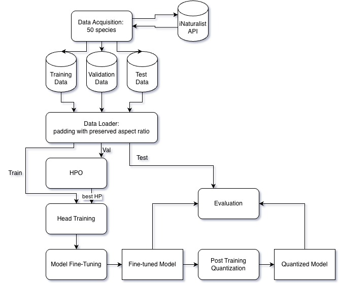
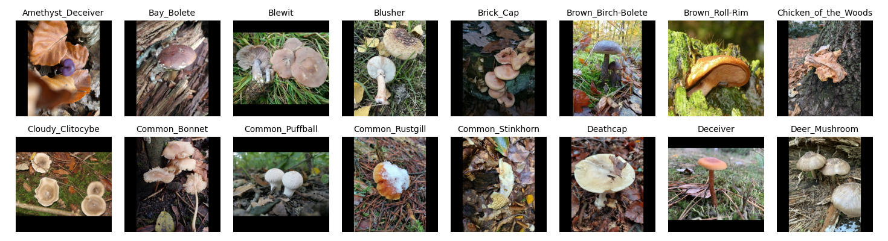

# Quantized Mushroom Classification 🍄

When foraging for mushrooms, many people struggle to identify the type of mushroom they have found. There is a wide variety of mushrooms one might stumble across in the woods, and many mushrooms have similar appearances making them difficult to distinguish. It is important to know whether or not the mushroom is edible. If it is, one would also like to know if it is tasty. To accomplish this, we built a model capable of identifying 50 species of mushrooms. The output is top five species of mushroom, whether it’s edible and the certainty of the prediction. Furthermore, cell service is often unavailable in the forest, so it is beneficial to have a system which works offline. For this purpose, we also attempted to compress through weight quantization.

---

## Table of Contents

1. [Related work](#related-work)
2. [Procedure](#procedure)
3. [Results and evaluation](#results-and-evaluation)
4. [Project Setup](#project-setup)  
5. [Sources](#sources)

---

## Related Work
Fine-grained image classification has been widely studied using deep convolutional neural networks (CNNs), particularly following the success of residual architectures such as ResNet (He et al., 2016). These approaches have demonstrated strong performance in distinguishing visually similar categories, especially when combined with transfer learning and data augmentation techniques. More recently, models such as EfficientNet and EfficientNetV2 (Tan & Le, 2019; Tan & Le, 2021) have achieved state-of-the-art accuracy–efficiency trade-offs by jointly scaling network depth, width, and input resolution. This compound scaling strategy makes them particularly well-suited for deployment in computationally constrained environments.

In the domain of automated mushroom identification, prior work has explored classification using fine-tuned CNN architectures (Jacob, M.S. et al., 2025). Furthermore, recent research by Adhikari et al. (2024) investigated model compression techniques for mushroom recognition, focusing on seven edible species to enable efficient deployment in practical settings.

Model compression and quantization have become established strategies for reducing model size and inference latency (Jacob, B. et al., 2018; Rokh et al., 2023). In particular, weight quantization enables significant reductions in memory footprint while often causing only minimal accuracy degradation, thereby facilitating deployment on resource-constrained devices such as mobile and embedded systems.


## Procedure

The primary goal of this project is to investigate how model compression, specifically weight quantization, influences classification performance in a fine-grained, safety-relevant image recognition task. The focus of the evaluation lies in understanding the trade-off between model accuracy, reliability, and deployment efficiency, particularly in offline scenarios where computational resources are limited.

The implementation uses python 3.11 and tensorflow for better compatibility with the chosen models (EfficientNet-V2).

### Pipeline Overview


The pipeline begins with Data Acquisition, where labeled mushroom images are retrieved from the dataset source and prepared for experimentation. This step is performed once at the beginning and forms the foundation for all subsequent experiments.

For each model configuration, the following steps are then executed:

1. Data Loading
2. Hyperparameter Optimization
3. Head Training
4. Fine-tuning (skipped for ResNet50)
5. Post-Training Quantization (PTQ)
6. Evaluation


### Data Acquisition

The dataset is loaded via API from [iNaturalist](https://www.inaturalist.org/) and consists of labeled mushroom images covering approximately 50 species. Species were selected based on their prevalence in iNaturalist submissions from Germany and were restricted to those exhibiting typical mushroom morphology, excluding lichens and other non-mushroom fungi. For each species, roughly 1,000 images were collected, limited to observations originating from Germany and designated as research-grade. For information regarding reuse of the data, please refer to the DATASET_LICENSE. To reflect realistic deployment constraints and reduce computational cost, lower-resolution images are used throughout the experiments. This choice also allows us to assess how well modern convolutional architectures generalize under constrained input quality.




### Data Loading and Preprocessing

The data loader performs the following preprocessing steps:

- Rescaling input images to a fixed resolution
- Padding to preserve aspect ratio where necessary
- Data augmentation (random flips, rotations, zoom, and contrast adjustments) to improve generalization and robustness

These steps are applied consistently across all models to ensure fair comparison.

### Models for Comparison

To evaluate both accuracy and efficiency, several architectures and training strategies are compared:

- EfficientNet-V2-M (fine-tuned):    
EfficientNet-V2-M is selected as the primary model due to its strong performance on lower-resolution images and its suitability for transfer learning. Larger variants (V2-L / V2-XL) are excluded as they typically require high-resolution inputs to fully leverage their capacity.

- EfficientNet-V2-M (fine-tuned + quantized):   
The same fine-tuned model is further compressed using quantization-aware training (QAT) to evaluate the impact of weight quantization on accuracy, calibration, and inference speed.

- Baseline model (ResNet):  
A standard ResNet architecture is used as a baseline. Only the final classification layer is replaced and trained, without full fine-tuning, to provide a lower-bound reference for performance.

- Optional, was not implemented for now:   EfficientNet-V2-S (fine-tuned):   
If time permits, a smaller EfficientNet-V2-S model is fine-tuned to analyze performance–efficiency trade-offs for even more constrained deployment scenarios and to compare the quantized model with the smaller version of the same model.

### Training Procedure

Training is performed in three stages:

- **Hyperparameter Optimization:**  
Prior to full fine-tuning, hyperparameter optimization is performed to identify suitable configurations for learning rate, batch size, optimizer settings, and regularization strength. This ensures that the final comparison between full-precision and quantized models is based on well-tuned training conditions.

- **Fine-tuning phase:**
The classifier head is trained first, followed by partial unfreezing of the backbone to adapt high-level features to the mushroom classification task.

- **Post-Training Quantization (PTQ):**  
After fine-tuning is completed, the trained full-precision EfficientNet-V2-M model is converted using post-training quantization. A representative dataset is used during calibration to minimize accuracy degradation and ensure a fair comparison between the full-precision and quantized versions.


All experiments are tracked using Weights & Biases (W&B) to log hyperparameters, training curves, evaluation metrics, and model artifacts.

### Evaluation Metrics

Model performance is evaluated using the following metrics:

- Top-1 accuracy
- Top-5 accuracy (crucial given the large number of visually similar species)
- Precision, Recall, and F1-score, with particular emphasis on the edible vs. poisonous distinction
- Model size (MB) to quantify compression benefits
- Inference time on CPU, reflecting realistic offline deployment conditions
- Accuracy degradation after quantization, measuring the cost of compression

### Additional Analysis

Given the safety-critical nature of mushroom identification, confidence reliability is also evaluated:

- Calibration metrics such as Expected Calibration Error (ECE)
- Analysis of prediction confidence to assess whether the model’s certainty aligns with its accuracy

Reliable confidence estimates are especially important when advising users about edibility, where incorrect but overconfident predictions could have severe consequences.
---
## Results and Evaluation

Overall, the baseline ResNet-50 model outperformed the fine-tuned EfficientNetV2-M model in our experiments. Model quantization was effective in reducing both the model size and computational requirements, demonstrating its potential for deployment in resource-constrained environments. However, this compression came at the cost of a noticeable decline in predictive performance.

These findings suggest that quantization could be a viable approach for this use case, provided it is applied to a stronger-performing base model. As future work, we recommend exploring smaller pre-trained variants of EfficientNetV2, which may offer a more favorable trade-off between efficiency and accuracy. In addition, further experimentation with refined fine-tuning strategies may help improve overall performance and better leverage the capabilities of the underlying architecture.

All metrics are computed on a holdout test set.

### Species Accuracy

No experimets yielded a sufficent top-1 accuracy for real-world deployment. The ResNet50 attained the highest top-5 accuracy of 0.91. This would allow users to further investigate and correclty identify species in most cases. 

| Model | Top-1 Acc. | Top-5 Accuracy |
|-------|-----------------|---------------------|
| ResNet50  | 0.67 | 0.91 |
| EfficientNet-V2-M (finetune)   | 0.57 | 0.86 |
| EfficientNet-V2-M (finetune+quantized)   | 0.43 | 0.75 |

### Edibility Metrics

Edibility-related evaluation metrics were computed to assess the likelihood that the models incorrectly classify inedible species as edible. We pay special attention to precision, minimize the likelihood of labeling a poisonous mushromm as edible.

This is not high enough for safe use. It would also be interesting to look at precision@5 since the top 5 species would be made available to the user with confidence scores.

| Model | Precision | AUC_ROC |
|-------|-----------------|---------------------|
| ResNet50  | 0.89 | 0.84 |
| EfficientNet-V2-M (finetune)   | 0.87 | 0.81 |
| EfficientNet-V2-M (finetune+quantized)   | 0.84 | 0.74 |

#### Edibility-Related Confusion Matrix for the ResNet50 Model


### Quantization

We evaluate the fine-tuned EfficientNetV2-M model using standard float32 weights against the fully quantized TFLite version, in which both weights and computations are represented as 8-bit integers. 

#### Model Size

Quantization effectively reduced the model’s memory footprint, resulting in a 4.03× smaller model compared to the original float32 version.

| Model               | Size (MB) |
|---------------------|-----------|
| float32             | 230       |
| TFLite INT8         | 57        |

#### Evaluation Metrics

Compression didn’t affect species already misclassified, but introduced errors in additional species, driving most of the accuracy loss.

| Metric               | float32 | TFLite INT8 | Difference (Abs) | Difference (%) |
|----------------------|---------|-------------|------------------|----------------|
| accuracy_species     | 0.5748  | 0.4333      | -0.1415          | -24.62%        |
| top_5_accuracy       | 0.8570  | 0.7489      | -0.1081          | -12.62%        |
| precision_edible     | 0.8681  | 0.8379      | -0.0302          | -3.47%         |
| auc_edible           | 0.8086  | 0.7420      | -0.0666          | -8.24%         |

### Confidence Evaluation
The fine-tuned Efficient_net-V2-M achieved a Top-1 accuracy of 0.57, indicating moderate species-level performance. Analysis of prediction confidence revealed a low mean confidence of 0.26 with a standard deviation of 0.2, suggesting that the model is generally uncertain and moderately variable in its predictions. While this underconfidence may reduce the risk of overconfident errors in a safety-critical context like mushroom identification, low-confidence predictions could be prioritized for human review to enhance safety.

---
## Project Setup

Clone the repository:

```bash
git clone https://github.com/ninaimmenroth/quantized-mushroom-classification
cd quantized-mushroom-classification
```

The `requirements.txt` file is already included in the repo.


### Virtual Environment Setup

#### Mac / Linux

```bash
python3.11 -m venv .venv
source .venv/bin/activate
```

#### Windows (CMD)

```bash
python3.11 -m venv .venv
.venv\Scripts\activate.bat
```

#### Windows (PowerShell)

```bash
python3.11 -m venv .venv
.venv\Scripts\Activate.ps1
```

After activation, your prompt should show:

```
(.venv) $
```


### Install Dependencies

With the virtual environment active:

```bash
pip install --upgrade pip setuptools wheel
pip install -r requirements.txt
```

**Optional GPU acceleration on Mac (M1/M2/M3)**:

```bash
pip install tensorflow-metal
```


### Verify Installation

Check TensorFlow version and available devices:

```bash
python - <<EOF
import tensorflow as tf
print("TensorFlow version:", tf.__version__)
print("Available devices:", tf.config.list_physical_devices())
EOF
```

You should see your CPU and optionally GPU devices listed.


### Running the Training Script

```bash
python train_efficientnet_v2.py
```

- Training automatically loads images from:
  - `data/train/` → training images
  - `data/val/` → validation images
- The script handles:
  - Resize with padding (aspect ratio preserved)
  - Data augmentation (rotation, zoom, contrast, flip)
  - Two-stage training: head training + fine-tuning


### Project Directory Structure

```
mushroom-classification/
├── train_efficientnet_v2.py
├── requirements.txt
├── data/
│   ├── train/
│   │   ├── species1/
│   │   ├── species2/
│   │   └── ...
│   └── val/
│       ├── species1/
│       ├── species2/
│       └── ...
└── .venv/   # virtual environment folder
```


### Optional GPU Setup

#### Mac (Apple Silicon)
```bash
pip install tensorflow-metal
```

#### Windows / Linux (NVIDIA)
- Install CUDA + cuDNN as per TensorFlow GPU guide
- TensorFlow will automatically detect GPU at runtime


### Deactivating the Environment

When finished:

```bash
deactivate
```

Your shell prompt will return to normal.


---

## Sources
- Adhikari, B., Hossain, M. M., Akter, S., & Ahamed, M. S. (2024, June). MushroomDetect: An Investigation into Local Mushroom Classification in Bangladesh Using Transfer Learning. In 2024 15th International Conference on Computing Communication and Networking Technologies (ICCCNT) (pp. 1-6). IEEE.
- He, K., Zhang, X., Ren, S., & Sun, J. (2016). Deep residual learning for image recognition. In Proceedings of the IEEE conference on computer vision and pattern recognition (pp. 770-778).
- Jacob, B., Kligys, S., Chen, B., Zhu, M., Tang, M., Howard, A., ... & Kalenichenko, D. (2018). Quantization and training of neural networks for efficient integer-arithmetic-only inference. In Proceedings of the IEEE conference on computer vision and pattern recognition (pp. 2704-2713).
- Jacob, M. S., Xu, A., Qian, K., Qi, Z., Li, X., & Zhang, B. (2025). Artificial Intelligence in Edible Mushroom Cultivation, Breeding, and Classification: A Comprehensive Review. Journal of Fungi, 11(11), 758. https://doi.org/10.3390/jof11110758
- Rokh, B., Azarpeyvand, A., & Khanteymoori, A. (2023). A comprehensive survey on model quantization for deep neural networks in image classification. ACM Transactions on Intelligent Systems and Technology, 14(6), 1-50.
- Tan, M., & Le, Q. (2019, May). Efficientnet: Rethinking model scaling for convolutional neural networks. In International conference on machine learning (pp. 6105-6114). PMLR.
- Tan, M., & Le, Q. (2021, July). Efficientnetv2: Smaller models and faster training. In International conference on machine learning (pp. 10096-10106). PMLR.
